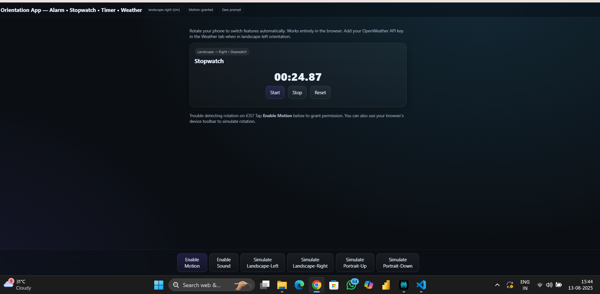
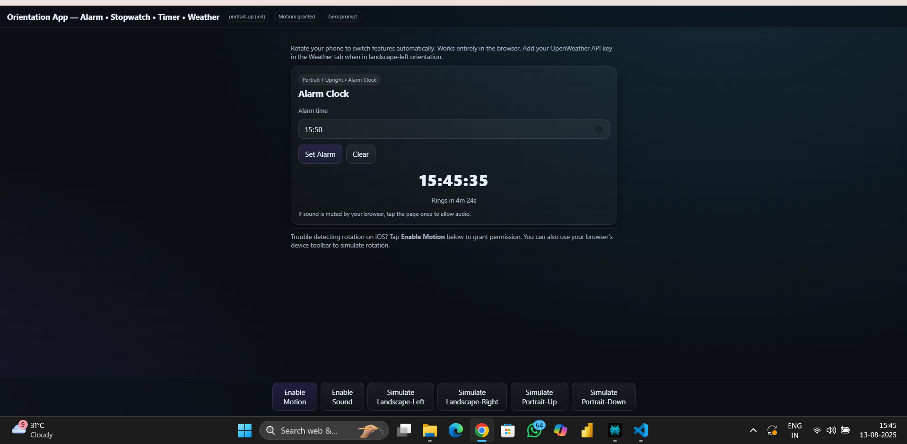
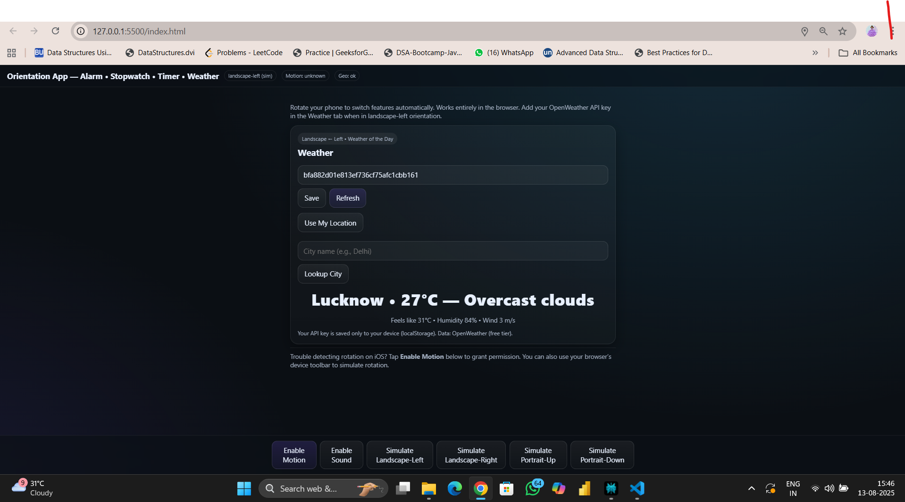

# SkySense AI

SkySense AI is an AI-powered weather application built with HTML, CSS, and JavaScript, integrated with the OpenWeather API for real-time weather data and ChatGPT for smart, conversational weather insights.

A web-based weather application that provides real-time weather updates, AI-powered suggestions, and user-friendly interaction.  
Built with **HTML**, **CSS**, **JavaScript**, **OpenWeather API**, and **ChatGPT API**.

---

## 📌 Features

- Search weather by city name.
- Displays temperature, humidity and weather description.
- AI-generated tips & recommendations based on weather conditions.
- Responsive and minimal UI.

---

## 🛠️ Tech Stack

- **Frontend:** HTML, CSS, JavaScript
- **API:** OpenWeather API, OpenAI API
- **AI Tool:** ChatGPT for generating weather-based insights.

---

## 📸 Screenshots

### Homepage




### Weather Search Result



## 💬 Prompts Used

Below are the main AI prompts used for generating responses:

"Write HTML, CSS, and JavaScript code for a simple weather app using the OpenWeather API that fetches temperature, humidity, and weather conditions by city name."

"Explain how to fix the 400: Bad Request error when fetching data from the OpenWeather API in JavaScript."

"Create a mobile-first single-file HTML with four feature sections (Alarm, Stopwatch, Timer, Weather) hidden by default and a sticky status bar."

"Write JS that robustly detects portrait-up, portrait-down, landscape-left, landscape-right across Android/iOS using ScreenOrientation, window.orientation, and DeviceOrientationEvent as fallbacks."

"Implement a high-precision stopwatch with Start/Stop/Reset using performance.now() and requestAnimationFrame."

"Implement a countdown timer and an alarm clock with time input, human-readable remaining time, and Web Audio beep on finish."

"Fetch current weather using OpenWeather by geolocation (lat/lon), with API key saved to localStorage; render summary string and feels-like details."

Failed prompt : "Autoplay audio without user gesture" — browsers block this; solved by explicit 'Enable Sound' button.

"Add error handling to show a message when the city name entered is invalid or empty."

"Style the weather app with responsive CSS and center it on the page."

"Show how to parse and display the weather icon from the OpenWeather API in my HTML."

"Modify the JavaScript to show weather details only if the API call is successful."

"Explain how to store and use my OpenWeather API key securely in JavaScript (without exposing it in public repos)."

---

## 🚀 Getting Started

1. Clone the repository:

```bash
git clone https://github.com/yourusername/smart-weather-companion.git
Navigate to the project folder:
cd smart-weather-companion
Open index.html in your browser.

🔑 API Keys
Get an API key from OpenWeather

Get an API key from OpenAI

Create a config.js file:

const OPENWEATHER_API_KEY = "your_openweather_api_key";
const OPENAI_API_KEY = "your_openai_api_key";

```
